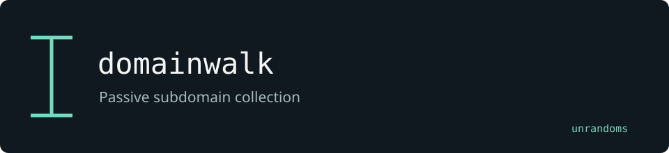

# domainwalk

Collects and deduplicates subdomains from public data providers. This fork adds configurable FOFA and ZoomEye sources, with response fixtures and tests.

Maintained by [unrandoms](https://github.com/unrandoms), derived from [lumiaurora/subscan](https://github.com/lumiaurora/subscan).

## Fork-specific work

- [`internal/sources/fofa.go`](internal/sources/fofa.go)
- [`internal/sources/zoomeye.go`](internal/sources/zoomeye.go)
- [`internal/sources/fofa_test.go`](internal/sources/fofa_test.go)

## Validation and limits

FOFA and ZoomEye require credentials. Hunter support and ASN enrichment are not implemented in this version.

This documentation update does not certify all inherited features. The [archived reference](UPSTREAM_README.md) describes the original ecosystem; its package names and release links may target upstream rather than this fork.

## Credits

See [CREDITS.md](CREDITS.md) for the distinction between the original implementation and this fork's adaptations. Original licenses and copyright notices remain in the repository.
